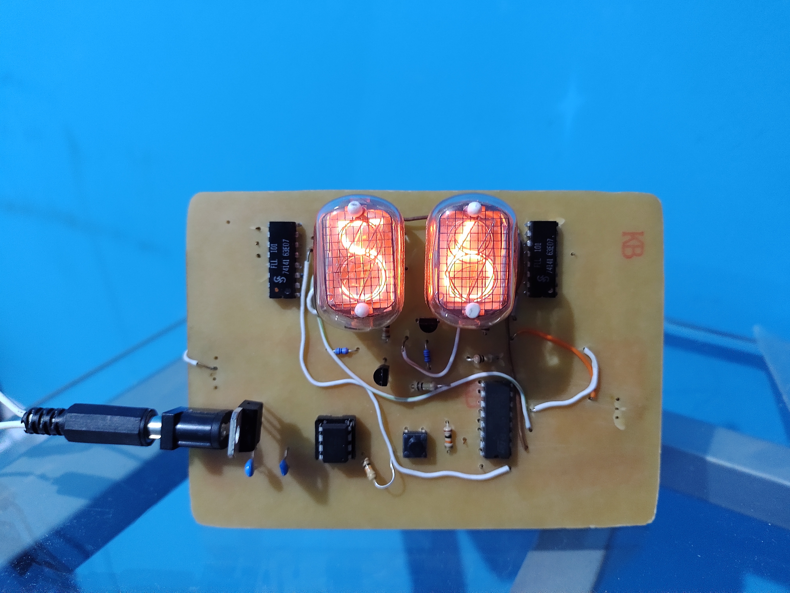

 Esquematicos y codigo pedorro actual del reloj nixie de 2 digitos que diseñé con 2 tubos IN-12.
 El codigo por ahora solo es para que funcione pero está abierta la posibilidad de meterle varias cosas, usé el core del attiny85 este: https://github.com/SpenceKonde/ATTinyCore
### Fotolas

